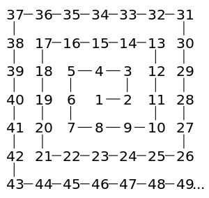
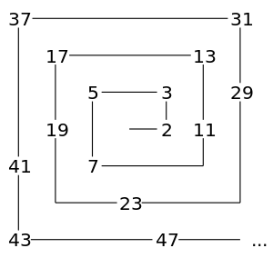

# Ulam-spiral

The very first project made during my studies.

## Description

The Ulam spiral is a specific type of graphic created by visualizing the sequence of
prime numbers on a plane. The Ulam spiral consists of points on the plane, where these
points represent consecutive natural numbers, and the points representing prime numbers
are usually highlighted in color.

 (spiral) 
 (Ulam spiral)

## Project requirements

1. Write a Java program using the AWT library that generates an Ulam spiral. Assume
that the generated spiral will start (be anchored) in the middle of the screen and will be
drawn in the form of a square filling the entire application window.
2. Because checking whether a number is prime is a costly operation, make sure that
the prime numbers for a square with a side length 10 times larger than the application
window being opened are calculated during the first application run. Save the calculated
data in a binary file according to the following format:
   * the first 8 bytes in each line represent how many prime numbers are saved in that
   line;
   * after 8 bytes, the unsupervised prime numbers are written according to the assumption that the first line contains only numbers that require exactly one byte to be
   saved, the second line contains only numbers that require exactly 2 bytes to be
   saved, in the third line 3 bytes are required, etc.